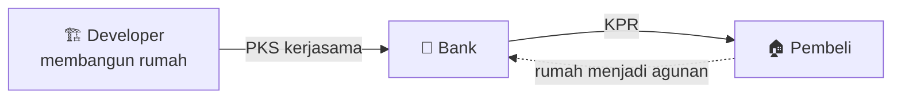
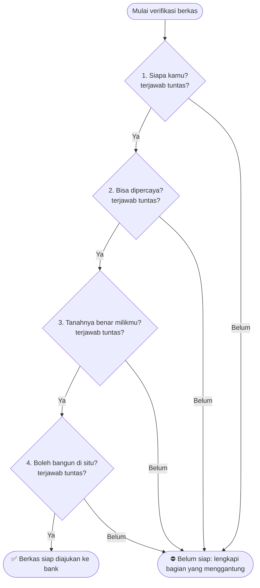

# 4 Pertanyaan Bank dalam Verifikasi Dokumen Perusahaan/Developer

> Satu kerangka sederhana untuk memahami **mengapa** bank meminta puluhan dokumen dari perusahaan/developer, dan bagaimana membacanya dengan cepat.

**Cocok untuk:** pemula di pembiayaan properti (KPR developer), analis magang, dan siapa pun yang perlu memverifikasi berkas kerjasama developer.

## Daftar Isi

- [Logika Dasar](#logika-dasar)
- [Peta Empat Pertanyaan](#peta-empat-pertanyaan)
- [Pertanyaan 1: Siapa Kamu?](#pertanyaan-1-siapa-kamu)
- [Pertanyaan 2: Bisa Dipercaya?](#pertanyaan-2-bisa-dipercaya)
- [Pertanyaan 3: Tanahnya Benar Milikmu?](#pertanyaan-3-tanahnya-benar-milikmu)
- [Pertanyaan 4: Boleh Bangun di Situ?](#pertanyaan-4-boleh-bangun-di-situ)
- [Cara Pakai Saat Verifikasi](#cara-pakai-saat-verifikasi)
- [Contoh Penerapan](#contoh-penerapan)
- [Di Luar 4 Pertanyaan: Kelengkapan Administrasi](#di-luar-4-pertanyaan-kelengkapan-administrasi)
- [Istilah Lama dan Baru](#istilah-lama-dan-baru)
- [Catatan](#catatan)

---

## Logika Dasar

Bank membiayai **pembeli rumah**, tetapi rumahnya dibangun oleh **developer**. Rumah itu menjadi **agunan** kredit.

> [!IMPORTANT]
> Kalau developer bermasalah (bangkrut, lahan sengketa, izin tidak sah), agunan ikut bermasalah dan **bank yang menanggung risikonya**.

Karena itu, sebelum bank menandatangani PKS, developer harus menjawab **4 pertanyaan mendasar**. Seberapa pun banyaknya dokumen yang diminta, semuanya hanyalah jawaban atas 4 pertanyaan ini.

---

## Peta Empat Pertanyaan

| # | Bank bertanya | Dokumen yang menjawab |
|:-:|---|---|
| 1 | **Siapa kamu?** | Akta, SK Menkumham, NPWP, NIB, KTP pengurus |
| 2 | **Bisa dipercaya?** | iDeb/SLIK, Checking Internal, Pengalaman |
| 3 | **Tanahnya benar milikmu?** | Sertifikat, Surat Pernyataan, KSO |
| 4 | **Boleh bangun di situ?** | Izin Lokasi/KKPR, Site Plan, IMB/PBG |

### Pemetaan Sektor Checklist Bank ke 4 Pertanyaan

Checklist dokumen dari bank biasanya dibagi per sektor (Perizinan Usaha, Akta, Perizinan Lahan, BI Checking, dan seterusnya). Berikut posisi tiap sektor di dalam 4 pertanyaan:

| Sektor di checklist bank | Masuk pertanyaan |
|---|:-:|
| B. Perizinan Usaha (NPWP, NIB, TDP/SIUP, KTP direksi & pemegang saham) | 1 — Siapa kamu? |
| C. Akta Pendirian dan Perubahannya (Akta, SK Menkumham, BNRI) | 1 — Siapa kamu? |
| E. BI Checking (SLIK) | 2 — Bisa dipercaya? |
| D. Perizinan Lahan & Sertifikat — bagian kepemilikan (Sertifikat Induk/Pecahan, KSO/Kuasa Menjual) | 3 — Tanahnya benar milikmu? |
| D. Perizinan Lahan & Sertifikat — bagian izin bangun (Izin Lokasi/KKPR, Site Plan disahkan, IMB/PBG) | 4 — Boleh bangun di situ? |

> [!TIP]
> Sektor D itu campuran dua pertanyaan sekaligus: sebagian dokumennya bicara soal *kepemilikan* tanah (Pertanyaan 3), sebagian lagi soal *izin membangun* di tanah itu (Pertanyaan 4). Sektor A (Aplikasi) tidak muncul di tabel ini karena memang di luar 4 pertanyaan — lihat [Di Luar 4 Pertanyaan](#di-luar-4-pertanyaan-kelengkapan-administrasi).

---

## Pertanyaan 1: Siapa Kamu?

**Bank ingin tahu:** apakah developer adalah badan usaha yang sah, dan siapa yang bertanggung jawab.

| Dokumen | Menjawab apa |
|---|---|
| Akta Pendirian | Bukti resmi perusahaan didirikan, memuat aturan main dan siapa pendirinya |
| SK Menkumham | Pengesahan negara bahwa akta tersebut sah secara hukum |
| Akta Perubahan *(bila ada)* | Siapa direksi/pemegang saham saat ini, jika pernah berganti |
| NPWP Perusahaan | Identitas pajak resmi badan usaha |
| NIB | Bukti terdaftar dan diizinkan menjalankan usaha (pengganti TDP/SIUP) |
| KTP Direksi & Pemegang Saham | Individu yang bertanggung jawab di balik badan hukum |

**Bila menggantung:** identitas dan penanggung jawab developer belum terverifikasi penuh.

---

## Pertanyaan 2: Bisa Dipercaya?

**Bank ingin tahu:** apakah developer punya rekam jejak bersih dan terbukti mampu menyelesaikan proyek.

| Dokumen / Proses | Menjawab apa |
|---|---|
| iDeb/SLIK OJK | Riwayat kredit developer dan pengurus: pernah macet bayar atau tidak |
| Checking Internal Bank (DHN/PPATK/DTTOT/NPF/WO) | Apakah developer/pengurus pernah tersangkut masalah hukum atau pendanaan |
| Bukti Pengalaman (portofolio proyek, referensi bank sebelumnya) | Apakah developer terbukti bisa menyelesaikan proyek, bukan baru coba-coba |

> [!TIP]
> Data KTP dan NPWP dari developer hanyalah **kunci untuk dicek** di iDeb dan checking internal. Hasil cek dikeluarkan oleh bank/OJK, bukan dokumen bukti dari developer.

**Bila menggantung:** rekam jejak belum terbukti, sehingga keyakinan bank pada kemampuan developer belum ada.

---

## Pertanyaan 3: Tanahnya Benar Milikmu?

**Bank ingin tahu:** apakah lahan yang akan dibangun rumah sah dikuasai developer, dan tidak sedang bersengketa atau menjadi jaminan di tempat lain.

| Dokumen | Menjawab apa |
|---|---|
| Sertifikat Induk / Daftar Sertifikat Pecahan (SHGB/SHM) | Bukti kepemilikan lahan yang sah |
| Surat Pernyataan Tidak Dijaminkan | Konfirmasi sertifikat tidak sedang digadaikan ke bank atau pihak lain |
| KSO / Akta Kuasa Menjual | Bila lahan bukan milik developer sendiri: bukti developer berhak membangun dan menjual di atasnya |

**Bila menggantung:** hak developer atas lahan masih dipertanyakan (sengketa, dijaminkan, atau bukan miliknya).

---

## Pertanyaan 4: Boleh Bangun di Situ?

**Bank ingin tahu:** apakah proyek punya izin resmi, sesuai tata ruang dan aturan pemerintah daerah.

| Dokumen | Menjawab apa |
|---|---|
| Izin Lokasi / KKPR | Lahan memang diperuntukkan untuk perumahan, sesuai rencana tata ruang |
| Site Plan yang Disahkan | Rancangan kawasan sudah disetujui resmi oleh dinas terkait |
| IMB / PBG | Izin mendirikan bangunan fisik sudah atau sedang diproses secara sah |

**Bila menggantung:** proyek berisiko dianggap tidak sah atau terhenti di tengah jalan.

---

## Cara Pakai Saat Verifikasi

Setiap kali menerima dokumen dari developer, sebelum bingung "ini masuk kategori mana", tanyakan dulu:

> **"Dokumen ini sedang menjawab pertanyaan bank yang mana: 1, 2, 3, atau 4?"**

Begitu tahu pertanyaan mana yang dijawab, jelas apa yang dibuktikan dokumen itu, dan jika kurang, di bagian mana risikonya.

> [!WARNING]
> Kalau **satu saja** dari 4 pertanyaan masih menggantung, berkas developer **belum siap** diajukan ke bank, sekuat apa pun jawaban di 3 pertanyaan lainnya.

---

## Contoh Penerapan

| Dokumen yang diterima | Menjawab pertanyaan | Status | Artinya |
|---|:-:|---|---|
| Surat progress PBG | 4 | Belum tuntas (masih proses) | Keyakinan bank soal "boleh bangun di situ" masih menggantung |
| SK Menkumham tanpa Akta Pendirian | 1 | Belum lengkap | SK bukan pengganti akta, identitas developer belum terverifikasi penuh |
| SHGB sudah atas nama PT sendiri | 3 | Tuntas dari sisi kepemilikan | Dokumen pihak ketiga (KSO) otomatis tidak diperlukan |

---

## Di Luar 4 Pertanyaan: Kelengkapan Administrasi

Kerangka 4 pertanyaan menilai **kelayakan** developer. Tapi ada satu kelompok dokumen yang tidak menjawab satu pun dari 4 pertanyaan itu — fungsinya beda, yaitu sebagai **pintu masuk proses** dan bahan hitung teknis. Kalau kelompok ini kosong, statusnya bukan "pertanyaan menggantung", melainkan **berkas belum lengkap secara administrasi**.

| Dokumen | Menjawab apa |
|---|---|
| Aplikasi Kerjasama Developer | Formulir resmi dari bank — titik awal seluruh proses, bukan buatan developer |
| Brosur & Daftar Harga terbaru | Bahan hitung plafon KPR per unit |
| Contoh PPJB & Surat Pesanan | Format transaksi standar (harus blanko kosong, bukan dokumen riil pembeli tertentu) |

> [!TIP]
> Bedakan sumbernya: Aplikasi Kerjasama Developer diminta ke **RM bank**, sedangkan Brosur & Daftar Harga diminta ke **developer** (biasanya bagian marketing) dan harus versi terbaru.

Jadi checklist verifikasi lengkap punya dua lapis:

1. **Lapis administrasi** — dokumen di atas ini, dicek lebih dulu sebagai syarat proses bisa jalan.
2. **Lapis kelayakan** — 4 pertanyaan bank di bagian sebelumnya.

> [!NOTE]
> Apakah lapis kelayakan boleh mulai diverifikasi sebelum lapis administrasi lengkap, atau harus menunggu, tergantung SOP masing-masing bank. Tanyakan ke pembimbing/RM bila belum jelas.

---

## Istilah Lama dan Baru

Beberapa dokumen di checklist masih memakai nama lama. Kenali padanannya agar tidak bingung.

| Nama lama | Pengganti |
|---|---|
| TDP, SIUP | NIB / perizinan berusaha berbasis risiko |
| IMB | PBG |
| Izin Lokasi | KKPR |
| BI Checking | SLIK OJK (iDeb) |

---

## Catatan

> [!NOTE]
> Dokumen ini adalah **catatan belajar** untuk memahami logika verifikasi. Ketentuan resmi (parameter, daftar dokumen wajib, batas) mengikuti SOP dan kebijakan bank yang berlaku.
